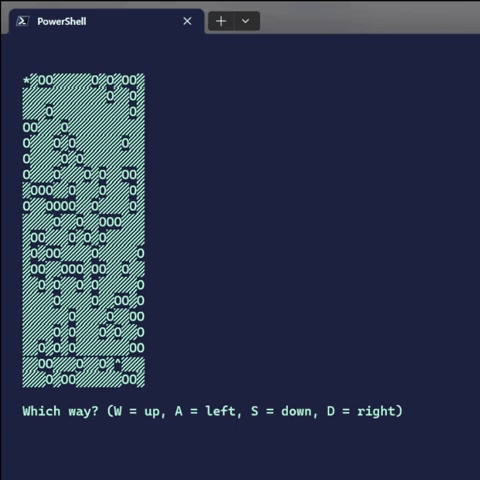

# Find your Hat Game

A simple terminal based game written in Node.js that generates a field of empty spaces (denoted by `▓`) and holes (denoted by `O`) where you the player, `*`, must navigate through the maze to your hat, `^`.

 

## Sample Game

 

## Future Improvements

### `.validateField()` Method
The field currently generates the number of holes based on a percentage passed in to the `.generateField()` method and randomly inserts them into the field. This means that a field can be created with no possible solution. It would be nice if there was a method on the Field class that made sure for each hole added to the field, solution was still possible.

 

### Insert more holes over time
Assuming the above method was implemented, to make the game more challenging, more holes could be added after a certain amount of turns, ideally causing the player to rethink their path.

